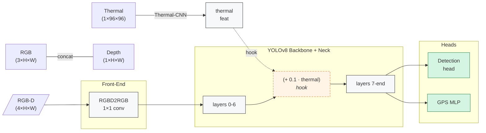

# 5D YOLOv8 + GPS — Multi-Modal Object Detection and Localisation

A PyTorch implementation of Ultralytics **YOLOv8** extended to consume  
**RGB + Depth + Thermal** (5-channel) input and regress a global **GPS (lat, lon)**  
for every frame.

[](https://www.python.org/)  
[](https://pytorch.org/)  
[](https://github.com/ultralytics/ultralytics)  
[](LICENSE)


## 📋 Overview

* **5-channel input** `RGB (3) + Depth (1) + Thermal (1)`  
* **Thermal fusion** Injected at YOLO’s mid-feature via a forward hook  
* **Dual-head output** Standard YOLO detections **plus** a 2-D GPS vector  
* **Joint training** Ultralytics v8 detection loss + MSE GPS loss — all weights train

Ideal for robotics, autonomous driving, or any scenario where object
detection and coarse localisation must be learned from multiple sensors.


## 🛠 Installation

```bash
git clone https://github.com/farshidrayhancv/yolo5D_plus_gps.git
cd yolo5D_plus_gps

# core dependencies
pip install torch torchvision matplotlib tqdm pillow ultralytics==8.3.140
---

> **Requirements**  Python 3.8+, PyTorch 2.1+, torchvision, Ultralytics 8.3.x


## 💻 Usage

### 1 · Training

```bash
python train_5d.py          # trains on VOC 2012 with synthetic depth+thermal
```

### 2 · Inference (post-processed boxes + GPS)

```python
import torch
from train_5d import YOLO5D          # model class lives in the training script

model = YOLO5D().eval()
model.load_state_dict(torch.load("ckpts/yolo5d_best.pt", map_location="cpu"))

rgb      = torch.rand(3, 320, 320)
depth    = torch.rand(1, 320, 320)
thermal  = torch.rand(1, 96, 96)
rgbd     = torch.cat([rgb, depth]).unsqueeze(0)

results, gps = model.predict(rgbd, thermal)   # NMS boxes + (1,2) GPS

print("boxes:", results[0].boxes.xyxy)
print("GPS  :", gps.squeeze().tolist())
```

---

## 🧠 Architecture



* **RGB-D Adapter** – collapses 4 → 3 channels so YOLO can ingest the frame.
* **Thermal Processor** – embeds & upsamples the thermal map.
* **Hook** – adds thermal features into layer-6 activations *during* forward pass.
* **Heads** – YOLO detection head predicts boxes/classes; a small MLP regresses GPS.

---

## 📊 Current Demo Numbers (synthetic)

| Model     | Input | Dataset    | Det loss ↓ | GPS loss ↓ |
| --------- | ----- | ---------- | ---------- | ---------- |
| 5D-YOLO-n | 320   | VOC 2012\* | 7.7        | 1.8 e-5    |

\* Depth / thermal and GPS are synthetic placeholders — detection loss is
real but GPS numbers are meaningless until real coordinates are supplied.

---

## 🗂 Project Structure

```
├── train_5d.py               # full training + model definition
├── ckpts/                    # saved checkpoints
├── data/                     # VOC dataset will download here
└── README.md
```

---

## 🔄 Customisation Tips

* **Plug in real depth & thermal**
  Replace the random tensors in `VOCExtended.__getitem__`.

* **Use real GPS labels**
  Swap the fixed `[0.5,0.5]` with your `(lat_norm, lon_norm)` values.

* **Tune loss balance**
  Adjust `LAMBDA_GPS` to weight GPS vs. detection learning.

---

## 📋 TODO

* [ ] Integrate real multi-sensor datasets (NYU Depth, FLIR, etc.)
* [ ] Hyper-parameter sweep for GPS/det loss weighting
* [ ] Export ONNX / TensorRT for edge deployment
* [ ] Benchmark on Jetson & Raspberry Pi

---

## 📄 License

Released under the MIT License.

---

## 🙏 Acknowledgements

* **[Ultralytics YOLOv8](https://github.com/ultralytics/ultralytics)** – fantastic open-source detector.
* Pascal VOC for the benchmark images.


