# 5D YOLOv8 + GPS — Multi-Modal Object Detection and Localization

A PyTorch implementation of Ultralytics **YOLOv8** extended to consume  
**RGB + Depth + Thermal** (5-channel) input and regress a global **GPS (lat, lon)**  
for every frame.

[](https://www.python.org/)  
[](https://pytorch.org/)  
[](LICENSE)

## 📋 Overview

* **5-channel input processing:**
  * RGB (3 channels) + Depth (1 channel) → 4-channel tensor
  * Thermal (1 channel) → independent processing path
* **Modality fusion architecture:**
  * RGB-D → 1×1 conv adapter → YOLOv8 backbone
  * Thermal → CNN → injected at backbone layer-6 via hook
* **Dual-output model:**
  * Standard YOLO detection head (boxes, classes)
  * GPS regression head (2D coordinates from feature map)
* **Joint training:**
  * Ultralytics v8 detection loss + MSE GPS loss
  * Different learning rates for new layers vs backbone

Ideal for robotics, autonomous driving, or any scenario where object
detection and coarse localization must be learned from multiple sensors.

## 🛠 Installation

```bash
git clone https://github.com/farshidrayhancv/yolo5D_plus_gps.git
cd yolo5D_plus_gps
```

## Core Dependencies
```bash
pip install torch torchvision matplotlib tqdm pillow ultralytics==8.3.140
```

**Requirements:** Python 3.8+, PyTorch 2.1+, Ultralytics 8.3.x

## 💻 Usage

### 1 · Training

```bash
python train.py          # trains on VOC 2012 with synthetic depth+thermal
```

#### Training Options

```bash
python train.py --batch-size 16 --epochs 50  # override config values
python train.py --resume best                # resume from best checkpoint
```

### 2 · Inference

```bash
python inference.py --image path/to/image.jpg  # run inference on image
python inference.py --image path/to/image.jpg --output results.png  # save visualization
```

### 3 · Programmatic Usage

```python
import torch
from models import YOLO5D
import config as cfg

# Load model
model = YOLO5D().eval()
model.load_state_dict(torch.load("ckpts/yolo5d_best.pt", map_location="cpu"))

# Prepare input tensors
rgb = torch.rand(3, cfg.IMG_SIZE, cfg.IMG_SIZE)           # RGB image
depth = torch.rand(1, cfg.IMG_SIZE, cfg.IMG_SIZE)         # Depth map 
thermal = torch.rand(1, cfg.THERMAL_SIZE, cfg.THERMAL_SIZE)  # Thermal image
rgbd = torch.cat([rgb, depth]).unsqueeze(0)               # Combine for model input

# Run inference
results, gps = model.predict(rgbd, thermal)   # Returns NMS boxes + (1,2) GPS

# Print results
print("Detected objects:", len(results[0].boxes))
print("Detection boxes:", results[0].boxes.xyxy)
print("GPS coordinates:", gps.squeeze().tolist())
```

---

## 🧠 Architecture

```mermaid
flowchart LR
    %% Input nodes
    RGB[("RGB<br>(3×320×320)")]
    DEPTH[("Depth<br>(1×320×320)")]
    THERM[("Thermal<br>(1×96×96)")]
    
    %% First level processing
    RGB --> CONCAT
    DEPTH --> CONCAT
    CONCAT(("concat"))
    RGBD[/"RGBD<br>(4×320×320)"/]
    CONCAT --> RGBD
    
    %% Model subgraphs
    subgraph Adapter
        ADAPT["1×1 Conv<br>4ch → 3ch"]:::block
    end
    
    subgraph "YOLOv8 Backbone"
        Y0["Layers 0-6"]:::block
        HOOK{{"Fusion Hook"}}:::hook
        Y1["Layers 7+"]:::block
        
        Y0 --> HOOK --> Y1
    end
    
    subgraph "Thermal Path"
        T0["Conv 3×3<br>1ch → 16ch"]:::block
        T1["Conv 1×1<br>16ch → mid_ch"]:::block
        TUP["Bilinear<br>Upsample"]:::block
        
        T0 --> T1 --> TUP
    end
    
    subgraph "Output Heads"
        DET["Detection<br>Head"]:::head
        GPS["GPS MLP<br>Head"]:::head
    end
    
    %% Connections between components
    RGBD --> Adapter
    ADAPT --> Y0
    
    THERM --> T0
    TUP -.-> |"+0.1×"|HOOK
    
    Y1 --> DET
    Y1 --> GPS
    
    %% Styling
    classDef block fill:#f6f8fa,stroke:#333,stroke-width:1px;
    classDef head fill:#d5f5e3,stroke:#1e8449,stroke-width:1px;
    classDef hook fill:#fef9e7,stroke:#f39c12,stroke-width:1px,stroke-dasharray:3;
```



### Architecture Details

1. **Input Processing**
   * **RGB-D Adapter**: Converts 4-channel RGB-D input to 3-channel input using a 1×1 convolution. The adapter is initialized with identity weights for RGB channels and a small weight (0.1) for the depth channel.
   * **Thermal Processing**: Processes the lower-resolution thermal input through a small CNN network to generate feature maps that match the backbone's spatial dimensions.

2. **Feature Fusion**
   * **Mid-level Hook**: Thermal features are fused into the main backbone at layer 6 using a forward pre-hook. This additive fusion (original + 0.1 × thermal features) allows thermal information to influence later detection stages.

3. **Output Heads**
   * **Detection Head**: Standard YOLOv8 detection head for object detection
   * **GPS Head**: Custom MLP that takes the backbone features, applies global average pooling, and regresses to 2D GPS coordinates in [0,1] range

4. **Training Strategy**
   * Joint optimization of detection and GPS regression
   * Higher learning rate for new components (1e-3) vs. backbone (1e-4)
   * Weighted sum of detection loss and GPS MSE loss

---

## 📊 Current Demo Performance

| Model     | Input Size | Dataset    | Detection Loss↓ | GPS Loss↓  |
|-----------|------------|------------|----------------|------------|
| 5D-YOLO-n | 320×320    | VOC 2012*  | 7.7            | 1.8e-5     |

\* *Depth, thermal, and GPS in this demo are synthetic placeholders. Detection loss is real, but GPS performance is meaningless until real coordinates are supplied.*

---

## 🗂 Project Structure

```
├── config.py               # Configuration parameters
├── models.py               # Model definition and components
├── dataset.py              # Dataset and data loading functions
├── utils.py                # Utility functions
├── train.py                # Training script
├── inference.py            # Inference script
├── ckpts/                  # Saved model checkpoints
├── data/                   # VOC dataset downloads here automatically
└── README.md               # This file
```

---

## 🔄 Customization Guide

### Using Real Data

This implementation currently uses synthetic depth, thermal, and GPS data. To use real data:

1. **Real depth & thermal inputs**:
   * Modify `VOCExtended.__getitem__` in `dataset.py` to load real depth and thermal data
   * Adjust `ThermalProcessor` parameters in `models.py` based on your thermal sensor characteristics

2. **Real GPS labels**:
   * Replace the fixed `[0.5, 0.5]` GPS coordinates with actual normalized GPS values
   * Consider data normalization strategies for GPS coordinates

3. **Performance tuning**:
   * Adjust `LAMBDA_GPS` in `config.py` to balance detection vs. localization learning
   * Modify learning rates based on your dataset characteristics
   * Consider freezing backbone for transfer learning scenarios

### Advanced Modifications

* **Custom backbones**: Replace YOLOv8-nano with other model sizes (s/m/l/x)
* **Alternative fusion strategies**: Modify the hook to use concatenation or attention-based fusion
* **Additional modalities**: Extend the model for lidar, radar, or other sensor inputs

---

## 📋 TODO

* [ ] Integrate real multi-modal datasets (NYU Depth, FLIR Thermal, etc.)
* [ ] Add evaluation metrics for both detection (mAP) and GPS (MSE)
* [ ] Implement TensorRT/ONNX export for edge deployment
* [ ] Create visualization tools for multi-modal inference
* [ ] Benchmark on embedded platforms (Jetson Nano, Xavier, RaspberryPi)
* [ ] Add support for temporal information (video sequences)

---

## 📄 License

Released under the Apache License, Version 2.0. See [LICENSE](LICENSE) file for details.

---

## 🙏 Acknowledgements

* **[Ultralytics YOLOv8](https://github.com/ultralytics/ultralytics)** - Base detection framework
* **Pascal VOC** - Benchmark detection dataset
* **PyTorch Team** - Deep learning framework